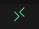

<div align="center">

<samp>

# python research environment

**Welcome to python research environment!!**

</samp>

</div>

## 概要
- こちらは研究で使うpythonの環境になっております
- アクシデントやトラブルがあった場合は岩月までお願いします

## 目次
1. [ディレクトリ構成](#anchor1)
2. [まず初めに](#anchor2)
3. [pythonの起動方法](#anchor3)
4. [その他各コマンドの説明](#anchor4)

## ディレクトリ構成<a id="anchor1"></a>
```md
.
│
├── .devcontainer/            # Devcontainer設定ファイル
│   └── devcontainer.json     # VS CodeのDevcontainer設定
│
├── .github/                  # GitHub Actions CI/CDワークフロー
│   └── workflows/            # CI/CDの定義ファイル
│       └── main.yml
│
├── data/                     # データセット
│   ├── raw/                  # 生データ
│   ├── processed/            # 前処理済みデータ
│   └── .dvc/                 # DVC管理ファイル
│
├── models/                   # 訓練済みモデルやモデルのアーティファクト
│
├── notebooks/                # Jupyterノートブック
│
├── src/                      # ソースコード
│   ├── __init__.py
│   ├── data_preparation.py   # データ前処理スクリプト
│   ├── train_model.py        # モデル訓練スクリプト
│   └── evaluate_model.py     # モデル評価スクリプト
│
├── tests/                    # テストコード
│   ├── __init__.py
│   └── test_data_preparation.py
│
├── docker                    # pythonのバージョンは全て
│   └── python
│       ├── 3.10
│       │   ├── Dockerfile
│       │   ├── poetry.lock
│       │   └── pyproject.toml
│       ├── 3.11
│       │   ├── Dockerfile
│       │   ├── poetry.lock
│       │   └── pyproject.toml
│       ├── 3.12
│       │   ├── Dockerfile
│       │   ├── poetry.lock
│       │   └── pyproject.toml
│       └── 3.9
│           ├── Dockerfile
│           ├── poetry.lock
│           └── pyproject.toml
├── Dockerfile                # Dockerコンテナ設定ファイル
├── Makefile                  # Makeコマンド定義ファイル
├── .env                      # 環境変数ファイル
├── .ruff.toml                # Ruff設定ファイル
├── requirements.txt          # Python依存関係リスト
├── CHANGELOG.md
├── LICENSE
├── Makefile                  # 関連コマンド一覧
└── README.md                 # プロジェクト説明書

```
## まずはじめに<a id="anchor2"></a>
### 1. いくつか入れて欲しいものがあるのでインストールする
1. Docker 
- [windowsはここからインストール](https://docs.docker.jp/desktop/install/windows-install.html#id4)
- [Macの人はここからインストール](https://docs.docker.jp/desktop/install/mac-install.html)
2. VScode or Cursor
- [windowsはここからインストール](https://code.visualstudio.com/docs/?dv=win32arm64user)
- [Macの人はここからインストール](https://code.visualstudio.com/docs/?dv=osx)
3. git
- [windowsのインストール手順](https://qiita.com/T-H9703EnAc/items/4fbe6593d42f9a844b1c)
- Macはデフォルトでインストール済み

**Macユーザーの場合はhomebrewを使ってインストールすることを推奨**
### 2. リポジトリをforkしてくる
### 3. フォークしたリポジトリを自分のPCにマージしてくる
```git clone フォークするリポジトリ```
- 以下に操作の動画を追加
https://www.loom.com/share/fee792587d9f49d18fc5688c4af78783
## pythonの起動方法<a id="anchor3"></a>
### 1. まずはPythonのバージョンを選択
- デフォルトは3.12になっています
- 変更したい場合は[その他各コマンドの説明](#anchor4)を参照
### 2. pythonをDockerを用いて起動
1. 左下ののマークを押す
2. その後 **コンテナーで再度開く** を押す
以上のコマンドによりPythonを起動
## その他各コマンドの説明<a id="anchor4"></a>
### コードを整形する場合
```make fix```
  - デフォルトではフォーマッターが整備されているため,ルールを守らないと,赤いエラーが吐かれる
  - 以下のコマンドを実行して,エラーを解消
### pythonのバージョンを変更する場合
```make version```
- 3.9 ~ 3.12まであります
### コミットする場合
```make commit```
- 選ぶと以下の選択肢が出てくるので,選択するものを選んでエンターキーを押す
```Need to install the following packages:
git-cz@4.9.0
Ok to proceed? (y) y
```
- 最初にこのような注意が入る可能性があるので y を押す
- そのあとは選択肢を選んでコミット
- そのあと```git push```を行う
